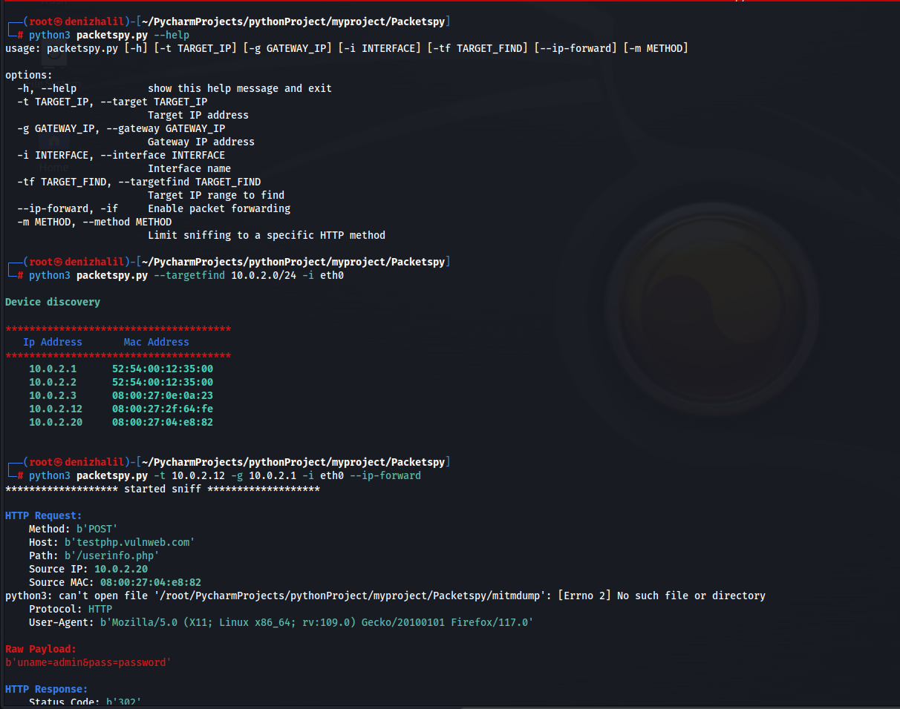

# PacketSpy

</img>

## Description
PacketSpy is a powerful network packet sniffing tool designed to capture and analyze network traffic. It provides a comprehensive set of features for inspecting HTTP requests and responses, viewing raw payload data, and gathering information about network devices. With PacketSpy, you can gain valuable insights into your network's communication patterns and troubleshoot network issues effectively.

<h4 align="center">
<br>
   <a href="https://buymeacoffee.com/halildeniz" target="_blank"></a>
</h4>

## Features
- **Packet Capture**: Capture and analyze network packets in real-time.
- **HTTP Inspection**: Inspect HTTP requests and responses for detailed analysis.
- **Raw Payload Viewing**: View raw payload data for deeper investigation.
- **Device Information**: Gather information about network devices, including IP addresses and MAC addresses.

## Installation
```
git clone https://github.com/HalilDeniz/PacketSpy.git
```

## Requirements
PacketSpy requires the following dependencies to be installed:
```
pip install -r requirements.txt
```

## Getting Started
To get started with PacketSpy, use the following command-line options:

```
root@denizhalil:/PacketSpy# python3 packetspy.py --help                          
usage: packetspy.py [-h] [-t TARGET_IP] [-g GATEWAY_IP] [-i INTERFACE] [-tf TARGET_FIND] [--ip-forward] [-m METHOD]

options:
  -h, --help            show this help message and exit
  -t TARGET_IP, --target TARGET_IP
                        Target IP address
  -g GATEWAY_IP, --gateway GATEWAY_IP
                        Gateway IP address
  -i INTERFACE, --interface INTERFACE
                        Interface name
  -tf TARGET_FIND, --targetfind TARGET_FIND
                        Target IP range to find
  --ip-forward, -if     Enable packet forwarding
  -m METHOD, --method METHOD
                        Limit sniffing to a specific HTTP method
```

## Examples
1. Device Detection
```
root@denizhalil:/PacketSpy# python3 packetspy.py -tf 10.0.2.0/24 -i eth0

        Device discovery
**************************************
   Ip Address       Mac Address
**************************************
    10.0.2.1      52:54:00:12:35:00
    10.0.2.2      52:54:00:12:35:00
    10.0.2.3      08:00:27:78:66:95
    10.0.2.11     08:00:27:65:96:cd
    10.0.2.12     08:00:27:2f:64:fe

```
2. Man-in-the-Middle Sniffing
```
root@denizhalil:/PacketSpy# python3 packetspy.py -t 10.0.2.11 -g 10.0.2.1 -i eth0
******************* started sniff *******************

HTTP Request:
    Method: b'POST'
    Host: b'testphp.vulnweb.com'
    Path: b'/userinfo.php'
    Source IP: 10.0.2.20
    Source MAC: 08:00:27:04:e8:82
    Protocol: HTTP
    User-Agent: b'Mozilla/5.0 (X11; Linux x86_64; rv:105.0) Gecko/20100101 Firefox/105.0'

Raw Payload:
b'uname=admin&pass=mysecretpassword'

HTTP Response:
    Status Code: b'302'
    Content Type: b'text/html; charset=UTF-8'
--------------------------------------------------
```
## FootNote
Https work still in progress

## Contributing
Contributions are welcome! To contribute to PacketSpy, follow these steps:
1. Fork the repository.
2. Create a new branch for your feature or bug fix.
3. Make your changes and commit them.
4. Push your changes to your forked repository.
5. Open a pull request in the main repository.

## Contact
If you have any questions, comments, or suggestions about PacketSpy, please feel free to contact me:
- LinkedIn: [LinkedIn](https://www.linkedin.com/in/halil-ibrahim-deniz/)
- TryHackMe: [TryHackMe](https://tryhackme.com/p/halilovic)
- Instagram: [Instagram](https://www.instagram.com/deniz.halil333/)
- YouTube: [YouTube](https://www.youtube.com/c/HalilDeniz)
- Email: halildeniz313@gmail.com

## License
PacketSpy is released under the MIT License. See [LICENSE](https://github.com/HalilDeniz/PacketSpy/blob/main/LICENSE) for more information.
